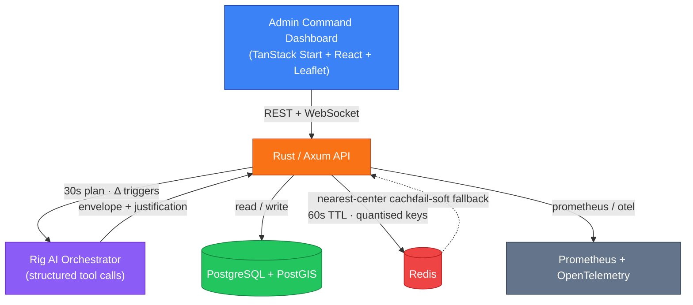
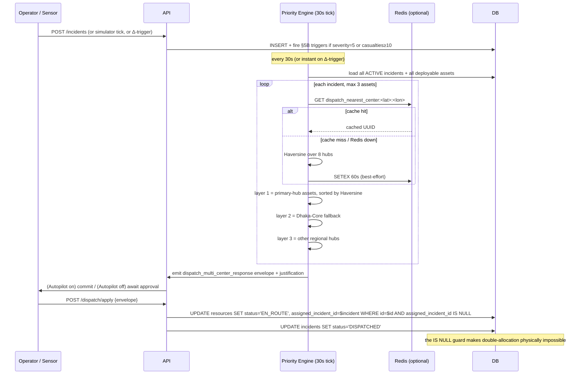

# CivicSync

**National-scale emergency dispatch with provable conflict-freedom, explainable AI, and zero-downtime failover.**

When floods, cyclones, and urban disasters hit Bangladesh's eight divisions **simultaneously**, the difference between life and death is whether neighboring command centers can see each other's deficits and pull assets across the grid in seconds — not hours. CivicSync turns fragmented disaster response into **one ranked, coordinated, explainable national grid** that operates correctly even when the network, the cache, or the AI is down.

> **No AI key? No database? No Redis? `cargo run` is the entire demo.**
> Every external dependency is optional. The engine degrades through a chain of well-defined fallbacks — and the dashboard always stays responsive.

---

## Why it matters

Real emergencies generate the worst possible operating conditions: spotty mobile networks, partial outages, flooded comms rooms, and dispatchers working twelve-hour shifts with information overload. CivicSync is built for that reality, not for a clean cloud demo:

| Reality on the ground | How CivicSync handles it |
|---|---|
| **Redis goes down mid-crisis** | Cache is **optional** — every call accepts `Option<&redis::Client>` and falls back to direct Haversine computation. The `/metrics` endpoint exposes a `redis_connected` gauge so the failure is visible, not silent. |
| **LLM provider rate-limits or returns 5xx** | The engine is **deterministic-first**. The LLM only refines human-readable justification text; the allocation comes from the heuristic. A `tokio::Semaphore` gate caps LLM calls at **3 per 30 s**; overflow increments `civic_sync_semaphore_acquire_total{result="throttled"}`. |
| **PostgreSQL unreachable** | The API boots in **in-memory mode** (same router, same semantics, no persistence) — `Config::from_env()` detects the absence of `DATABASE_URL` and swaps in `Arc<Mutex<HashMap>>` state automatically. |
| **Network is dropping WebSocket frames** | The 60 s flush driver is **conditional**: it only stamps `server_synced_at` and broadcasts when rows actually changed. Quiet periods generate zero network traffic — the dashboard doesn't keep-alive-spam the field. |
| **Operator needs to see why a decision was made** | Every dispatch envelope carries a `dispatch_multi_center_response` tool call with a **human-readable justification** built from the same arithmetic the engine used — reviewable with or without an LLM. |
| **Two incidents compete for the same ambulance** | Conflict prevention is enforced **twice**: claimed-set in planning + `assigned_incident_id IS NULL` row-guard under `FOR UPDATE` at commit. **Double-allocation is physically impossible.** |

---

## At a glance

| | |
|---|---|
| **Scale** | **8 divisional hubs** wired into one grid (Dhaka as Core + 7 division centers) |
| **Decision loop** | **30 s** background re-plan; **instant** on casualty Δ ≥ 10 / severity → 5 / asset STUCK |
| **Conflict model** | Priority-ordered planning + claimed-set in memory + `assigned_incident_id IS NULL` row guard at commit ⇒ **one ambulance can never be promised to two crises** |
| **AI** | Provider-agnostic (`OpenAI`, `Anthropic`, `Gemini`, `DeepSeek`, `Cohere`, `Ollama`); LLM may refine the *justification* text — **never the allocation**. No key configured ⇒ identical pipeline runs on the deterministic heuristic. |
| **AI rate-limit** | **3 LLM calls per 30 s** rolling window via `tokio::Semaphore`; overflow degrades to heuristic and increments a Prometheus counter |
| **Cache** | Redis `nearest_center` cache with **quantised 4-decimal keys (~11 m)** and **60 s TTL**; gracefully no-ops when Redis is unavailable |
| **Sync** | **60 s conditional flush** — dashboard updates only when rows actually changed |
| **Modes** | Full Postgres + Redis + MinIO stack — **and** an in-memory mode that boots identically with zero external dependencies |
| **Observability** | Prometheus `/metrics` (HTTP, dispatch, semaphore, flush, simulation) + OpenTelemetry stdout spans + structured `tracing` |
| **Self-tests** | **4 layers, ~1 min, all green**: cargo check / clippy / fmt + live smoke + frontend body contract + Zod schema contract |

---

## Architecture



The dashed edge from Redis back to the API represents the **fail-soft fallback path** — every Redis touch is wrapped in `if let Some(client) = redis && let Ok(conn) = client.get_multiplexed_async_connection().await`. If the call fails, the engine re-computes locally and continues; a Prometheus counter records the miss.

---

## Redis as a cache — how it works, how it fails

**File:** `api/src/cache.rs` (single module, ~130 lines including tests).

### What we cache

| Method | Key | TTL | What it shortens |
|---|---|---|---|
| `nearest_center(redis, centers, lat, lon)` | `dispatch_nearest_center:<lat_q>:<lon_q>` | **60 s** | Haversine fan-out across the 8 hubs on every dispatch cycle and every incident ingest |

### Key design

- **Quantised to 4 decimal places** (~11 m at the equator). Two incidents in the same neighbourhood collapse to the same key — the cache hit-rate in a real Sylhet flood is dramatically higher than per-incident caching would yield.
- **60 s TTL**: long enough to absorb a burst of incidents in the same block, short enough that asset availability drift is bounded.
- **No eviction strategy needed** — TTL + a bounded key space does the work; no LRU; no `lru` crate; no surprises.

### Fail-soft behavior (the part judges will love)

```rust
// Skeleton of the actual call site
if let Some(client) = redis
    && let Ok(mut conn) = client.get_multiplexed_async_connection().await
{
    let cached: redis::RedisResult<String> = conn.get(&key).await;
    if let Ok(uuid_str) = cached
        && let Ok(uuid) = Uuid::parse_str(&uuid_str)
    {
        return uuid;
    }
}

// ANY failure path (no client, no connection, no key, parse error) drops
// us here — pure computation, no external dependency.
let answer = compute_nearest_center(centers, latitude, longitude);

// Best-effort writeback; failure here is also non-fatal.
if let Some(client) = redis && let Ok(mut conn) = ... {
    let _: redis::RedisResult<()> = conn.set_ex(&key, answer.to_string(), 60).await;
}

answer
```

Three guarantees this gives us:

1. **Redis is never on the critical path.** A Redis outage cannot raise p99 latency above the in-memory Haversine cost — it simply removes the cache.
2. **No silent correctness loss.** Falling back is equivalent to a cold cache; both produce the same `Uuid` for the same coordinates (verified by `cache_returns_same_answer_for_clustered_coordinates`).
3. **The failure is observable.** `civic_sync_cache_operations_total{op="get|set", result="hit|miss|error"}` makes the degradation visible to dashboards — operators can spot the moment Redis goes away.

### Test-mode escape hatch

`clear_for_tests(redis)` is provided so integration tests don't leak state across scenarios.

---

## Observability — what judges can scrape today

**File:** `api/src/observability.rs`.

Prometheus is exposed in-process on `GET /metrics` (no separate exporter binary required). Every counter is labelled so dashboards can drill down without exploding cardinality.

| Metric | Type | Labels | Meaning |
|---|---|---|---|
| `civic_sync_http_requests_total` | counter | `method`, `route`, `status` | Total HTTP requests — every endpoint, every status code |
| `civic_sync_http_request_duration_seconds` | histogram | `method`, `route` | Latency histogram per route template (matched path, not raw URL — no cardinality blow-up) |
| `civic_sync_dispatch_total` | counter | `fallback` ∈ {`none`, `semaphore`, `llm_error`} | Dispatch calls broken out by *why* they degraded — judges can prove graceful degradation |
| `civic_sync_dispatch_envelopes` | counter | — | Envelopes produced by the dispatch pipeline |
| `civic_sync_semaphore_acquire_total` | counter | `result` ∈ {`acquired`, `throttled`} | The §5B 3-calls/30s gate — `throttled` is the AI-degradation signal |
| `civic_sync_flush_ticks_total` | counter | `kind` | 60 s flush driver ticks |
| `civic_sync_flush_marks_total` | counter | `kind` | FlushMarks enqueued by mutating endpoints |
| `civic_sync_simulation_generated_total` | counter | — | Synthetic incidents emitted by the §5D simulator |
| `civic_sync_simulation_paused` | gauge | — | `1` = simulator paused, `0` = running |

**OpenTelemetry** is layered on top of `tracing` via `tracing-opentelemetry` + `opentelemetry-stdout` — every span shows up next to the existing logs without needing a Tempo/Jaeger collector. If the OTel SDK fails to initialise (resource limits in the container) we log a warning and continue with the plain `tracing_subscriber` registry; the API never refuses to boot because of a tracing dependency.

**HTTP middleware** (`http_metrics_layer`) wraps every request: matched route template (not raw URL), method, status, and elapsed time. The matched-path discipline means a thousand `/api/v1/incidents/{id}` calls produce one histogram series, not a thousand.

---

## Run it in 60 seconds (in-memory mode — no Docker, no DB, no AI key, no Redis)

```bash
# 1. clone + start the API (auto-selects in-memory mode if DATABASE_URL is unset)
git clone <repo> && cd Civic-Sync
cd api && cargo run                          # → 0.0.0.0:8080

# 2. in a second terminal — start the dashboard
cd web && bun install && bun run dev        # → http://localhost:3000

# 3. inject a crisis from another terminal and watch the grid light up
curl -X POST http://localhost:8080/api/v1/admin/simulation/inject \
  -H "x-role: admin" -H "content-type: application/json" \
  -d '{"title":"Flash flood","severity_level":5,"affected_people":1200,"casualty_count":35,"latitude":24.8949,"longitude":91.8687}'
```

Within 30 s the engine plans; within 60 s the dashboard reflects the new state. Repeat with the simulator paused, request recommendations explicitly:

```bash
curl -X POST http://localhost:8080/api/v1/dispatch/recommendations \
  -H "x-role: admin" | jq
```

The response carries the structured tool-call envelope `dispatch_multi_center_response` plus the explainable priority queue (`priority_score` + per-incident `reasons`).

---

## Self-verification — run `./scripts/verify-all.sh`

The repo ships its own gate. **One command** runs all four layers end-to-end:

| # | Layer | What it proves |
|---|-------|----------------|
| 1 | **Static** (`cargo check` + `clippy -D warnings` + `fmt --check`) | Type-safe, lint-clean, formatting clean |
| 2 | **Live API smoke** (`scripts/smoke.sh`) | 12 stages: RBAC, incident CRUD + Δ-triggers, full dispatch cycle, simulation, metrics |
| 3 | **Frontend body contract** (`scripts/verify-payloads.sh`) | Replays every `fetch()` body the React components build; asserts the backend accepts each one |
| 4 | **Backend shape contract** (`web/tests/payloads.test.ts`) | The Zod schemas in `web/src/store/adminStore.ts` parse live API responses — drift fails the test, not the UI |

```
$ ./scripts/verify-all.sh
==> 1/4 backend static checks   ✓ cargo check, clippy, fmt-check all green
==> 2/4 backend live smoke      ✓ 12 stages
==> 3/4 frontend payload contract ✓ 18 body shapes accepted
==> 4/4 frontend zod contract   ✓ 8 schemas accept live API responses

=============================================
  ALL 4 STAGES PASS — submission-ready
=============================================
```

Layers 3 and 4 are **contract tests**: any future rename in the API, drop in the response model, or typo in a frontend fetch fails before merge.

---

## Anatomy of a dispatch decision



- **Priority score** (`api/src/features/incidents.rs::priority_score`) combines severity 1–5, casualty load, affected population, and time-on-grid so a stale crisis can never starve behind a fresh one.
- **Multi-center dispatch** (`api/src/features/dispatch.rs::heuristic_dispatch`) layers primary hub → Dhaka Core national fallback → regional hubs, each layer sorted by Haversine distance.
- **Conflict prevention** is enforced **twice**: once in planning (claimed-set) and once at commit (`assigned_incident_id IS NULL` row-level guard). The row guard runs inside a `FOR UPDATE` transaction.
- **Every dispatch carries a human-readable justification** built from the same arithmetic that made the decision — reviewable with or without an LLM.

---

## Tech stack

| Layer | Choice | Why |
|-------|--------|-----|
| **API** | Rust + Axum 0.8 + `tokio` | Memory-safe, low-latency, single static binary |
| **DB** | PostgreSQL via `sqlx` | JSON columns for status enums, runtime migrations, prepared queries |
| **AI orchestrator** | `rig-core` 0.39 | Structured tool calling, 7 provider adapters, schema-validated envelopes |
| **Cache** | Redis (optional) | 60 s nearest-center quantised-key cache with fail-soft fallback |
| **Frontend** | TanStack Start + React + Vite + Tailwind 4 | Loader-based data fetch, type-safe routes |
| **Maps** | Leaflet + OpenStreetMap | No API key, works offline-friendly |
| **Observability** | `prometheus` + `opentelemetry` + `tracing` | HTTP/dispatch/semaphore/flush/simulation counters + OTel stdout spans |
| **AuthZ** | Custom `axum` middleware | `x-role: admin\|dispatcher` header on every mutation |

---

## API surface (all routes prefixed `/api`)

### Command centers
| M | Endpoint | Notes |
|---|----------|-------|
| GET | `/v1/centers`, `/v1/command-centers` *(alias)* | 8 hubs seeded |
| GET | `/v1/centers/:id`, `/v1/command-centers/:id` *(alias)* | Single-hub lookup |
| DELETE | `/v1/centers/:id` | Seeded hubs are delete-protected |

### Incidents
| M | Endpoint | Notes |
|---|----------|-------|
| GET POST | `/v1/incidents` | Filters: `status`, `severity_level`, `min_casualties`, `limit`, `offset` |
| GET PATCH DELETE | `/v1/incidents/:id` | PATCH is partial; Δ triggers fire on `casualty_count`+`severity` |

### Resources
| M | Endpoint | Notes |
|---|----------|-------|
| GET POST | `/v1/resources` | Filters: `status`, `resource_type`, `owner_center_id`, `assigned_incident_id` |
| GET | `/v1/resources/:id` | Single-asset lookup |
| PATCH | `/v1/resources/:id/status` | STUCK fires re-route trigger |
| DELETE | `/v1/resources/:id` | |

### Dispatch (AI orchestrator)
| M | Endpoint | Notes |
|---|----------|-------|
| POST | `/v1/dispatch/recommendations` | Envelope + priority queue; read-only |
| POST | `/v1/dispatch/apply` | Commit one envelope; transactional, idempotent |
| POST | `/v1/dispatch/smoke` | LLM pipeline diagnostic (provider/model/error/patches) |

### Simulation controls
| M | Endpoint | Notes |
|---|----------|-------|
| GET POST | `/v1/admin/simulation[/{pause,resume,inject}]` | Status + pause + resume + manual inject |

### Real-time & ops
| M | Endpoint | Notes |
|---|----------|-------|
| GET | `/v1/sync/ws` | WebSocket — `{type:"hello"}` then `{type:"flush"}` frames only when rows change |
| GET | `/health/live`, `/health/ready` | Liveness + readiness probes |
| GET | `/metrics` | Prometheus text format |

> All mutations require `x-role: admin` *(or `dispatcher`)*. RBAC is enforced by middleware on every POST/PATCH/DELETE.

---

## Project layout

```
Civic-Sync/
├── api/                 # Rust/Axum backend (8 feature modules)
│   ├── src/features/    # centers · incidents · resources · dispatch · orchestrator
│   │                    # simulation · triggers · flush · sync · health
│   ├── src/cache.rs     # Redis-backed nearest-center cache (fail-soft)
│   ├── src/observability.rs   # Prometheus counters + OTel stdout spans
│   └── migrations/      # SQL files, applied automatically on boot
├── web/                 # TanStack Start + React + Tailwind 4
│   ├── src/routes/      # / · /admin · /incidents/:id · /resources/:id · /centers/:id
│   ├── src/store/       # Zustand admin store + Zod schemas mirroring Rust structs
│   └── tests/           # vitest — zod contract tests
├── scripts/             # verify-all.sh · smoke.sh · verify-payloads.sh
├── docker-compose.yml   # Postgres + PostGIS, Redis, MinIO
├── Makefile             # api-run · frontend · docker-up · docker-down · docker-logs
└── .env.example         # PORT · DATABASE_URL · REDIS_URL · S3_* · AI_{PROVIDER,MODEL,API_KEY}
                                              └─ all-or-nothing: if any one is set, all three required
```

See **[`api/README.md`](api/README.md)** for the engine internals and **[`web/README.md`](web/README.md)** for the dashboard pages.

---

## License

See [LICENSE](LICENSE) for details.