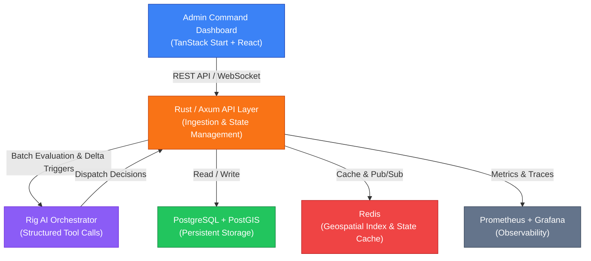

# CivicSync

**AI-Orchestrated National Emergency Response & Resource Optimization Platform**

---

## Overview

CivicSync is a real-time, AI-powered emergency response coordination platform designed for nationwide disaster management across Bangladesh. The system connects **8 divisional command hubs** (Dhaka Core + Chittagong, Rajshahi, Khulna, Barisal, Sylhet, Rangpur, Mymensingh) into a unified emergency grid. It continuously ingests multi-region incident streams, dynamically prioritizes crises by severity and geospatial proximity, and orchestrates optimal resource dispatch through an AI decision engine — all with full explainability and human-in-the-loop controls.

---

## Architecture



---

## Tech Stack

| Layer            | Technology                              |
| ---------------- | --------------------------------------- |
| **API**          | Rust + Axum                             |
| **AI Engine**    | Rig (Structured Tool Calling)           |
| **Frontend**     | TanStack Start + React + TailwindCSS    |
| **Database**     | PostgreSQL + PostGIS                    |
| **Cache**        | Redis (Pub/Sub & Geospatial Indexing)   |
| **Maps**         | Leaflet + OpenStreetMap                 |
| **Observability**| Prometheus + Grafana + OpenTelemetry    |

---

## Features

- **Real-Time Incident Tracking** — Continuous stream ingestion with severity-based prioritization (1–5 scale), casualty monitoring, and delta-trigger re-evaluation.
- **Haversine Geospatial Routing** — Computes great-circle distances from incident coordinates to all 8 command centers for optimal dispatch.
- **Multi-Center Dispatch** — Primary allocation from the nearest hub with automatic fallback to Dhaka Core Center when local assets face a deficit.
- **AI Orchestration** — Rig AI evaluates batched incidents every 30 seconds, emitting structured JSON tool call payloads with full justification.
- **Simulation Engine** — Built-in disaster generator with admin controls to pause, resume, and manually inject custom crisis incidents.
- **Human-in-the-Loop** — Operators can approve AI recommendations or enable Autopilot Mode for autonomous dispatch.
- **WebSocket Sync** — Real-time state synchronization with 60-second conditional flush to prevent unnecessary UI re-renders.

---

## Local Setup

### Prerequisites

- [Rust](https://rustup.rs/) (latest stable)
- [Bun](https://bun.sh/) (v1.0+)
- [Docker](https://docs.docker.com/get-docker/) & Docker Compose

### Steps

```bash
# 1. Clone the repository
git clone <repository-url>
cd Civic-Sync

# 2. Set up environment variables
cp .env.example .env
# Edit .env with your database credentials and API keys

# 3. Start infrastructure (PostgreSQL, Redis, MinIO)
docker compose up -d

# 4. Start the API server (port 8080)
cd api && cargo run

# 5. Start the frontend dev server (port 3000)
cd web && bun install && bun run dev
```

### Makefile Commands

| Command              | Description                                     |
| -------------------- | ----------------------------------------------- |
| `make api-run`       | Build and run the Rust backend API (port 8080)  |
| `make frontend`      | Run the TanStack React dev server (port 3000)   |
| `make docker-up`     | Spin up Postgres, Redis, and MinIO containers   |
| `make docker-down`   | Stop Docker Compose containers                  |
| `make docker-logs`   | View real-time logs from Docker Compose         |

---

## API Endpoints

All API routes are prefixed with `/api`.

### Health & Observability

| Method | Endpoint            | Description                  |
| ------ | ------------------- | ---------------------------- |
| GET    | `/health/live`      | Liveness probe               |
| GET    | `/health/ready`     | Readiness probe              |
| GET    | `/metrics`          | Prometheus metrics           |

### Command Centers

| Method | Endpoint              | Description                |
| ------ | --------------------- | -------------------------- |
| GET    | `/api/v1/centers`     | List all command centers   |
| GET    | `/api/v1/centers/:id` | Get a specific center      |
| DELETE | `/api/v1/centers/:id` | Delete a center            |

### Incidents

| Method | Endpoint                | Description              |
| ------ | ----------------------- | ------------------------ |
| GET    | `/api/v1/incidents`     | List all incidents       |
| POST   | `/api/v1/incidents`     | Create a new incident    |
| GET    | `/api/v1/incidents/:id` | Get incident details     |
| PATCH  | `/api/v1/incidents/:id` | Update an incident       |
| DELETE | `/api/v1/incidents/:id` | Delete an incident       |

### Resources

| Method | Endpoint                        | Description               |
| ------ | ------------------------------- | ------------------------- |
| GET    | `/api/v1/resources`             | List all resources        |
| POST   | `/api/v1/resources`             | Create a new resource     |
| PATCH  | `/api/v1/resources/:id/status`  | Update resource status    |
| DELETE | `/api/v1/resources/:id`         | Delete a resource         |

### Dispatch (AI Orchestrator)

| Method | Endpoint                            | Description                          |
| ------ | ----------------------------------- | ------------------------------------ |
| POST   | `/api/v1/dispatch/recommendations`  | Get AI dispatch recommendations      |
| POST   | `/api/v1/dispatch/apply`            | Apply a dispatch decision            |
| POST   | `/api/v1/dispatch/smoke`            | Smoke test dispatch pipeline         |

### Simulation Controls

| Method | Endpoint                            | Description                          |
| ------ | ----------------------------------- | ------------------------------------ |
| GET    | `/api/v1/admin/simulation`          | Get simulation status                |
| POST   | `/api/v1/admin/simulation/pause`    | Pause the disaster generator         |
| POST   | `/api/v1/admin/simulation/resume`   | Resume the disaster generator        |
| POST   | `/api/v1/admin/simulation/inject`   | Manually inject a crisis incident    |

### WebSocket

| Method | Endpoint              | Description                   |
| ------ | --------------------- | ----------------------------- |
| GET    | `/api/v1/sync/ws`     | Real-time state sync channel  |

---

## Database Schema

PostgreSQL with PostGIS extensions. All tables enforce `created_at`, `updated_at`, and `server_synced_at` timestamps.

| Table                  | Description                                                    |
| ---------------------- | -------------------------------------------------------------- |
| `command_centers`      | 8 divisional hubs with geographic coordinates (PostGIS Point)  |
| `incidents`            | Crisis events with severity (1–5), location, casualty counts   |
| `helper_teams`         | Human response teams with member counts and deployment status  |
| `resources`            | Vehicles & supplies (ambulances, boats, helicopters, food)     |
| `assistance_requests`  | Resource assistance requests linked to stuck/failed resources  |
| `helper_allocations`   | Junction table mapping teams to incidents or assistance tasks  |

---

## Project Structure

```
Civic-Sync/
├── api/                 # Rust/Axum backend API
├── web/                 # TanStack Start + React frontend
├── scripts/             # Utility scripts
├── docker-compose.yml   # Infrastructure stack
├── Makefile             # Developer commands
└── .env.example         # Environment template
```

See detailed documentation for each component:

- [**API README**](api/README.md) — Backend architecture, handlers, and AI orchestration
- [**Web README**](web/README.md) — Frontend dashboard, pages, and UI components

---

## License

See [LICENSE](LICENSE) for details.
